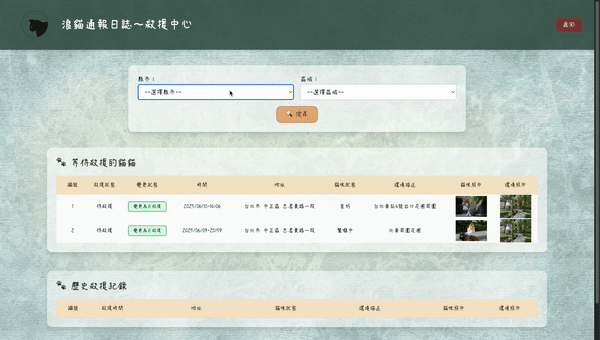

# 🐱 Stray Cat Rescue System | 浪貓通報與救援系統

一個協助愛心人士通報與協助救援浪貓的平台 🐾  
A platform to report and rescue stray cats, built with FastAPI & MongoDB.

---

## 📌 目錄 | Table of Contents

- 專案簡介 | [Introduction](#專案簡介--introduction)
- 網站功能 | [Features](#網站功能--features)
- 技術架構 | [Tech Stack](#技術架構--tech-stack)
- 操作方式 | [Getting Started](#操作方式--getting-started)
- 頁面預覽 | [Screenshots](#頁面預覽--screenshots)
  - 首頁 | [Index](#首頁--index)
  - 註冊功能 | [Register](#註冊功能--register)
  - 登入功能 | [Login](#登入功能--login)
  - 通報頁面 | [Reporter](#通報頁面--reporter)
  - 救援頁面 | [Rescuer](#救援頁面--rescuer)
- 作者資訊 | [About Me](#作者資訊--about-me)


---

##  專案簡介 | Introduction

因平日時常關注浪貓的相關資訊，故由此為發想點嘗試將通報平台實現出來，
網站內架設通報的相關功能如提供資訊、上傳照片等，  
讓有愛心的會員可透過網站資源進行通報與救援。

---

##  網站功能 | Features

✅ 使用者註冊／登入（含 bcrypt 加密）  
✅ 表單驗證與錯誤提示  
✅ 通報浪貓位置（地區、地址、描述）  
✅ 照片上傳表  
✅ 救援者查看待救援清單並變更狀態  
✅ 歷史紀錄查詢  

---

##  技術架構 | Tech Stack

**前端 | Frontend**
- HTML + TailwindCSS
- JavaScript (模組化)
- AJAX（動態狀態變更）

**後端 | Backend**
- Python FastAPI
- Jinja2 Template
- Pydantic 資料驗證
- bcrypt 密碼加密

**資料庫 | Database**
- MongoDB Atlas

---

##  操作方式 | Getting Started

```bash
git clone https://github.com/your-username/straycat-rescue.git
cd straycat-rescue
pip install -r requirements.txt
uvicorn main:app --reload
```
---

##  頁面預覽 | Screenshots


###  首頁 | Index


###  註冊功能 | Register


###  登入功能 | Login


###  通報頁面 | Reporter


###  救援頁面 | Rescuer



---

###  作者資訊 | About Me
* **轉職＆自學ing～目標成為一位後端工程師**
* 個人學、經歷請參考：[104履歷](https://pda.104.com.tw/profile/share/a52o5svb53aKxGBcphr2kuksTpBEFwCm)
